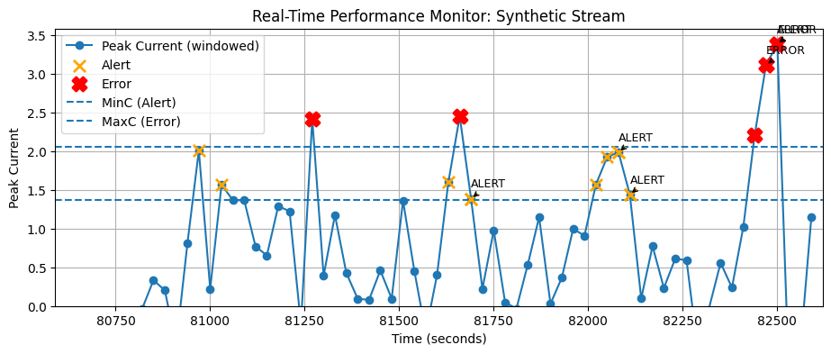

# 🤖 Practical Lab 1: Predictive Maintenance with Linear Regression Alerts

## 📖 Project Summary
This project implements an end-to-end MLOps pipeline for predictive maintenance on an 8-axis industrial robot. By applying **Univariate Linear Regression** and **Residual Analysis**, the system monitors motor current peaks to identify early signs of mechanical failure.

## 📂 Project Structure Overview

This project follows **MLOps (Machine Learning Operations)** architectural patterns to ensure reproducibility and modularity.

```text
.
├── configs/                # Configuration files (YAML) for DB and parameters
├── data/
│   ├── raw/                # Immutable original datasets (RMBR4-2_export_test.csv)
│   └── processed/          # Generated synthetic_test_data.csv & alert_events.csv
├── notebooks/              # Practical_Lab_1.ipynb (Main execution file)
├── src/                    # Modular Python scripts (stream_monitor.py, etc.)
├── requirements.txt        # Project dependencies
└── README.md               # Project documentation and threshold justification
```

## 🛠️ System Architecture & Features
* **Database Integration**: Real-time telemetry ingestion from **Neon.tech PostgreSQL**.
* **Feature Engineering**: Automated peak current extraction using 30-second sliding windows.
* **ML Analytics**: Linear Regression models ($Time \to Current$) for all 8 axes.
* **Proactive Monitoring**: Real-time **ETA (Estimated Time to Threshold)** calculation using regression slopes.

## 🔍 Threshold Discovery & Justification
Thresholds were not arbitrarily chosen; they were discovered by analyzing the **Residuals** (difference between actual and predicted values):

| Parameter | Value (Axis 1) | Evidence-Based Justification |
| :--- | :--- | :--- |
| **MinC (Alert)** | **1.372A** | Set at **$2\sigma$** (Standard Deviations) from the residual mean to capture early deviations. |
| **MaxC (Error)** | **2.058A** | Set at **$3\sigma$** from the mean, representing significant statistical outliers and critical stress. |
| **T (Persistence)** | **90s / 60s** | $T=3$ windows for Alerts and $T=2$ for Errors to filter out transient startup noise. |

## 🧪 Synthetic Data Generation
To test the pipeline's reliability, I generated **Synthetic Testing Data** using the **Inverse Z-score Standardization** logic:
* **Metadata Alignment**: The synthetic stream follows the `mean` and `std` of the original training data.
* **Standardization**: Applied the inverse of Z-score logic to ensure statistical realism.
* **Failure Simulation**: Injected controlled anomalies (deviations $> 3\sigma$) to verify that the **AlertEngine** correctly logs events.


## 📈 Visualizations & Results
The simulation generates a dynamic dashboard showing:
1. **Regression Trend Line**: Visualizes the current health trend and predicts potential failure points.
2. **Alert/Error Markers**: Real-time annotations indicating where persistent deviations exceeded the scientific thresholds.
3. **Event Logging**: All incidents are recorded in `data/processed/alert_events.csv` for auditing.

## 📈 Visualizations & Results

### 1. Real-Time Axis 1 Monitoring (MLOps Playback)
This plot illustrates the monitoring of actual robot telemetry data from Axis 1, processed through the real-time MLOps pipeline.


### 2. Synthetic Stream Simulation (Stress Testing)
This plot demonstrates the system's performance on synthetically generated data to verify that the Alert Engine accurately captures injected anomalies.


### 🔍 Visualization Annotations
To comply with requirements, the duration and threshold logic for each event are defined as follows:

* **Alert (Orange X)**: Triggered when the peak current exceeds the **1.372A** threshold for a sustained duration of **$\geq 90$ seconds** ($T=3$ windows).
* **Error (Red Cross)**: Triggered when the peak current exceeds the **2.058A** threshold for a sustained duration of **$\geq 60$ seconds** ($T=2$ windows).
* **Persistence Logic**: By requiring sustained deviations, the system successfully filters out transient motor startup spikes and high-frequency sensor noise, ensuring high reliability for predictive maintenance signals.

---

## 🚀 Setup Instructions
1. **Clone the Repository**:
   ```bash
   git clone [https://github.com/caatat741213/Practical-Lab-1---Streaming-Data-for-Predictive-Maintenance-with-Linear-Regression-Based-Alerts.git](https://github.com/caatat741213/Practical-Lab-1---Streaming-Data-for-Predictive-Maintenance-with-Linear-Regression-Based-Alerts.git)

2. **Environment**: Ensure you are using Python 3.9+ and install dependencies:
   ```bash
   pip install -r requirements.txt

## 💫 Final Conclusion
The successful integration of Linear Regression on current peaks proves to be a highly effective strategy for robot health monitoring. By moving from reactive repairs to Predictive Maintenance, we can significantly reduce industrial downtime.